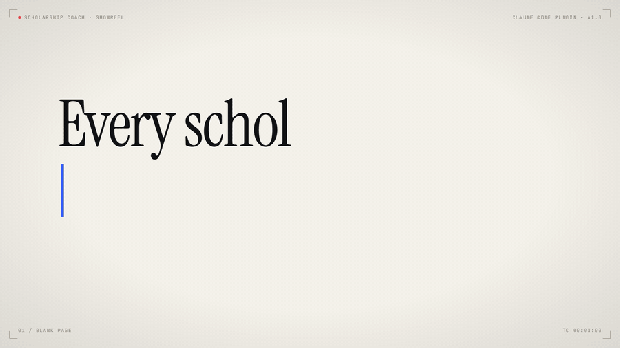
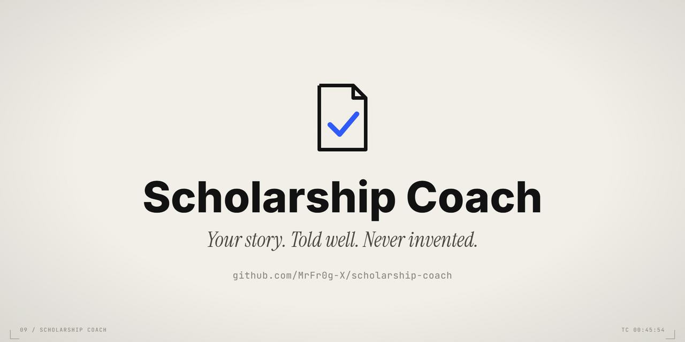
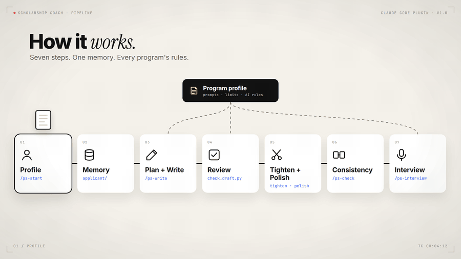

<div align="center">



# Scholarship Coach

**A Claude Code plugin that helps you write, review and defend scholarship essays.**<br>
Your story. Told well. Never invented.

[](LICENSE)
[](https://docs.claude.com/en/docs/claude-code/plugins)
[](#programs-and-ai-rules)
[](README.ar.md)

[Install](#install) · [Showreel](#showreel) · [What it does](#what-it-does) · [Programs](#programs-and-ai-rules) · [FAQ](#faq) · [العربية](README.ar.md)

</div>

---

Applying for Chevening, Fulbright, DAAD, Erasmus Mundus or a master's abroad usually means a pile of essays, one deadline and nobody honest to read them. Scholarship Coach turns Claude Code into that reader.

It interviews you once and remembers your stories. It reviews drafts the way a tired selection committee would. It catches the contradictions between your essays that you would never notice, knows what each program actually tests and what it says about AI, and rehearses the interview with you. It works in English and in Arabic, including Egyptian, Gulf, Levantine and Maghrebi dialects.

It is built on a proven personal statement method and on the official guidance of 12 scholarship programs.

## Showreel

<div align="center">

<a href="assets/showreel.mp4"></a>

<sub>▶ Click to watch. 47 seconds, with sound. Made in code: a GSAP timeline rendered frame by frame. Source in <a href="media/showreel">media/showreel</a>.</sub>

</div>

## Install

**Claude Code**

```text
/plugin marketplace add MrFr0g-X/scholarship-coach
/plugin install personal-statement-coach@scholarship-coach
```

Restart Claude Code and open it in the folder where you keep your application files.

**claude.ai**

Download [`dist/personal-statement-coach.skill`](dist/personal-statement-coach.skill) and upload it in *Settings → Capabilities → Skills*.

## Quick start

```text
/ps-start @my_cv.pdf              set up your profile once (stories, facts, voice)
/ps-write chevening leadership    full draft from your real facts, in your voice
/ps-review drafts/leadership.txt  honest 10 point scorecard and line by line notes
/ps-check chevening               contradictions and reused stories across essays
/ps-interview chevening           mock panel, one question at a time, scored
```

Or just talk to it:

```text
review my chevening networking essay, the limit is 300 words
راجعلي خطاب الحافز ده لمنحة DAAD
turn my Chevening essay into a UCL personal statement
I haven't done anything special. what can I even write?
```

## What it does

| | |
|---|---|
| **Remembers you** | Your story bank, a facts ledger and a sample of how you write live in `./applicant/` on your machine. You get interviewed once. Every essay after that reuses them. |
| **Reviews like a committee** | A 10 criterion scorecard calibrated against example essays, the top 3 fixes, and line by line notes that cite the exact rule you broke. |
| **Catches contradictions** | `check_consistency.py` reads all your essays together and flags the same story used twice, years that disagree ("2020" here, "2022" there) and numbers that don't match your facts ledger. |
| **Knows each program** | One profile per scholarship: what each essay really tests, a word budget per paragraph, official links, and a checklist of what to verify live. |
| **Knows the AI rules** | Chevening bans AI written answers. Rhodes allows limited help if you disclose it. DAAD allows it if declared. Cambridge bans it even for English. The coach tells you the exact rule once. |
| **Rehearses the interview** | A mock panel built from your own essays. One question per turn, follow up probes, a score for every answer. |
| **Finds your story** | "I haven't done anything special" becomes three to five strong angles, using the *how you tell it beats what you did* technique. |
| **Speaks your Arabic** | Answer in Egyptian, Gulf, Levantine or Maghrebi Arabic. It explains in your dialect and writes the essay in English. |
| **Never invents facts** | Anything it doesn't know becomes a visible `[PLACEHOLDER]`, and every draft comes with the list of facts you must be able to defend. |

## How it works

<div align="center">

</div>

One profile feeds every step. The program profile (prompts, limits, AI rules) shapes the writing, the review and the interview.

## Commands

| Command | What it does |
|---|---|
| `/ps-start` | Builds your `applicant/` profile, imports a CV or LinkedIn PDF |
| `/ps-write` | Full draft from your facts, in your voice, with a facts to verify list |
| `/ps-review` | Scorecard, top 3 fixes, line by line comments |
| `/ps-adapt` | Moves an essay from one program to another: keep, update, rewrite |
| `/ps-check` | Consistency across all essays, facts ledger and limits |
| `/ps-interview` | Mock panel: Chevening, Fulbright, Rhodes or Gates, university |
| `/ps-reframe` | Turns an ordinary experience into a strong story |
| `/ps-pitch` | 30 second and 60 second elevator pitch |

## Programs and AI rules

Each profile cites its official sources and records the date it was last checked. Deadlines and limits change every cycle, so the coach always tells you to confirm them on the live page.

| Program | Essays covered | AI rule (as last checked) |
|---|---|---|
| Chevening | Leadership, networking, studying in the UK, career plan | Prohibited |
| Rhodes | Personal statement, academic statement | Limited help, disclose tool and prompts |
| Gates Cambridge | Four questions, character limits | Prohibited for personal statements, even English help |
| DAAD (incl. EPOS) | Motivation letter | Allowed if declared |
| Fulbright | Personal statement, study objectives | Varies by country |
| Erasmus Mundus | Motivation letter | Set by each consortium |
| Commonwealth | Development impact, study plan, career plans, personal statement | Check the portal |
| MEXT | Field of study and research plan | Check the guidelines |
| GKS (Korea) | Personal statement, study plan | Check the guidelines |
| Türkiye Bursları | Letter of intent, character limit | Not published |
| Stipendium Hungaricum | Motivation letter | Not published |
| University SOP | Personal statement or SOP | Varies by university |

## The scripts

They also work on their own, no Claude needed.

```bash
python scripts/check_draft.py essay.docx --program chevening --essay leadership
python scripts/check_draft.py answer.txt --program gates-cambridge --essay leadership   # character limits
python scripts/check_consistency.py applicant/drafts/*.txt --facts applicant/facts.yaml --program chevening
python scripts/read_doc.py cv.pdf --out cv.txt     # optional: pip install pypdf python-docx
python scripts/profile_init.py                     # creates ./applicant, git ignored
```

<details>
<summary><b>Repository layout</b></summary>

```text
scholarship-coach/
├── .claude-plugin/marketplace.json
├── plugins/personal-statement-coach/
│   ├── .claude-plugin/plugin.json
│   ├── commands/                  8 slash commands
│   └── skills/personal-statement-coach/
│       ├── SKILL.md               the coach
│       ├── references/
│       │   ├── programs/          12 program profiles + AI rule matrix
│       │   ├── modes/             interview, reframe, profile, pitch, referee brief
│       │   ├── anchors/           calibrated example essays for scoring
│       │   ├── examples.md        writing moves with neutral examples
│       │   └── method.md, review-rubric.md, question-bank.md, voice-guide.md, arabic-glossary.md
│       ├── scripts/               check_draft, check_consistency, read_doc, profile_init
│       └── assets/applicant-template/
├── evals/                         16 test cases + trigger tests
├── tests/                         pytest for the scripts
├── media/showreel/                source of the video above
└── dist/personal-statement-coach.skill
```

</details>

## Honest by design

- **No invented facts.** Not even small ones like your first language or what your degree covered. Unknowns stay as placeholders until you fill them.
- **Your program's AI rule, stated once.** Some programs ban AI written essays, others ask you to declare it. Following your program's rules is your call, and the coach makes sure you know them.
- **No detector tricks.** The goal is a true story told well in your own voice, because that is what selection panels pick.
- **Your data stays local.** `applicant/` lives on your machine and is git ignored by default.

## FAQ

<details>
<summary><b>Will it just write my essay for me?</b></summary>

It can draft, if your program allows AI help. It builds the draft only from facts you gave it and marks every gap. For programs that ban AI written answers, like Chevening and Cambridge, it tells you so and works as a coach and reviewer instead.
</details>

<details>
<summary><b>How do I know the deadlines and limits are right?</b></summary>

The coach never states deadlines from memory. It checks the official page during the session and cites it, or tells you to confirm in your portal. Every program profile records when it was last checked.
</details>

<details>
<summary><b>Do I have to write to it in English?</b></summary>

No. Write in Arabic or any dialect. It replies in the same register and writes the essay in English, or German or French if your program needs it.
</details>

<details>
<summary><b>Is my data sent anywhere?</b></summary>

Your profile and drafts are plain files in `./applicant/` on your computer. They only reach Claude when you use them in a conversation, like any file you open in Claude Code.
</details>

## License

MIT.

<div align="center">

If it helped you get one step closer to your scholarship, a star helps other applicants find it.

</div>
